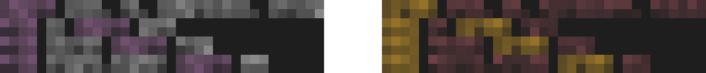
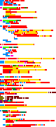

# Skills required: Planning an efficient solve, Data analysis, Solving cryptograms

In this challenge, players receive a png file taken from the *minimap* of VSCode as hinted at title. By default `editor.minimap.renderCharacters` is on and this can leak the whole program, given sufficient code text.

While the source code syntax coloring is customized (we'll go through that later), it is highly reminiscent of Python. I have put a trick to reduce guessing and cheesy solutions however, in that **the program is in fact a cryptogram and the syntax highlighting rules are based on the cryptogram instead of normal Python keywords**. This can be confirmed with a simple sanity check (observe the pixel sharpness):



*Normal Python text on the left; Actual image on the right*

An efficient solve path could be:

1. Segregate the different texts by their syntax-highlighting colors, this can be done by hand or K-means clustering techniques.
1. Identify exactly the various text colors
1. Recover the encoded program
1. Solving the cryptogram
1. Understanding the program and trivial bruteforcing
1. Get flag

### Segregate the different texts

- A key insight is that $\overrightarrow{text pixel}-\overrightarrow{background} = k * (\overrightarrow{text color}-\overrightarrow{background})$ and the normalized vector is dependent on true text color only
  - Clustering by hue only will not work, there are different shades used for similar hues.

```py
from PIL import Image, ImageColor
from colorsys import hsv_to_rgb
from sklearn.cluster import KMeans
from sage.all import vector
from sklearn.metrics import silhouette_score

bg = vector((30,30,30))
pixel_set = set()
all_pixels = list()
all_data = list()

with Image.open("JigII.rn.png") as im:
    rgb_im = im.convert('RGB')
    for y in range(0,im.height,2):
        for x in range(im.width):
            pixels = [vector(rgb_im.getpixel((x,y+i)))-bg for i in range(2)]
            pixels = sorted(pixels,key=lambda x:x.norm())
            if pixels[1].norm():
                new_pixel = tuple(pixels[1].normalized())
                # this only gets pixels that round differently, so (66,-6,-6) will not be considered if (33,-3,-3) is present (it's unnecessary)
                if not new_pixel in pixel_set:
                    all_data.append((y,x,rgb_im.getpixel((x,y)),rgb_im.getpixel((x,y+1))))
                    all_pixels.append(new_pixel)
                    pixel_set.add(new_pixel)

# print(all_pixels)
X = list(all_pixels)

max_result = (None, -1, None) # i, silhouette, model
for i in range(8,18):
    clusters = i
    kmeans = KMeans(n_clusters = clusters, n_init="auto")
    silhouette = silhouette_score(X, kmeans.fit_predict(X))
    if max_result[1] < silhouette:
        max_result = (i, silhouette, kmeans)
print(max_result[:2])

def hsv2rgb(h,s,v):
    return tuple(round(i * 255) for i in hsv_to_rgb(h,s,v))

with Image.open("JigII.rn.png") as im:
    im2 = Image.new(mode="RGBA", size=(im.width, im.height), color=(0,0,0,0))
    for y in range(0,im.height,2):
        for x in range(im.width):
            pixels = [vector(rgb_im.getpixel((x,y+i)))-bg for i in range(2)]
            pixels = sorted(pixels,key=lambda x:x.norm())
            if pixels[1].norm():
                new_pixel = tuple(pixels[1].normalized())
                cat = max_result[2].predict([new_pixel])[0]
                if cat<max_result[0]//2:
                    color = hsv2rgb(cat/(max_result[0]//2), 1, 1)
                else:
                    color = hsv2rgb((cat/(max_result[0]//2)) % 1, 1, 0.5)
                im2.putpixel((x,y), color+tuple([255]))
                im2.putpixel((x,y+1), color+tuple([255]))
    im2.save("clustering.png", "PNG")
    im2.show()
```



### Identify exactly the various text colors

The problem at hand has 2 variables: *which* character it is and *what* color it is. Considering the pixels individually may give you some results on the *character* but generally it performs poorly when it comes to pinpointing the color. This is why the clustering is needed.

It is very useful to generate a helper png file with `#ffffff` text color and `#000000` background color for reference.


As we only have `126-32+1=95` characters and the 3 channels can be considered separately, we can store the result of $i/255 * \overrightarrow{character}$ for each i in `[-0x1e,256-0x1e)` (background is `#1e1e1e`) and see if all character pixels can be generated by $i$.

Here's a sample script for calculating the skin biege color at around `(0,136)~(3,141)` in the picture (at the time of writing I did not implement clustering):

```py
from PIL import Image, ImageColor
from colorsys import rgb_to_hsv, hsv_to_rgb
from sage.all import vector

with Image.open("../../mini_palette/letters.png") as im:
    g_im = im.convert('L')
    letters = set()
    for x in range(im.width):
        for y in range(0, im.height, 2):
            letters.add(vector((g_im.getpixel((x,y+i)) for i in range(2)), immutable=True))

bg = (30,30,30)

def subtract_background(pixels):
    return list(map(lambda pixel: tuple(vector(x)-vector(bg) for x in pixel), pixels))

with Image.open("JigII.rn.png") as im:
    rgb_im = im.convert('RGB')
    yellow = set()
    for y in range(0,im.height,2):
        for x in range(im.width):
            hsv1 = rgb_to_hsv(*rgb_im.getpixel((x,y)))
            hsv2 = rgb_to_hsv(*rgb_im.getpixel((x,y+1)))
            valid = sorted(
                [hsv for hsv in (hsv1, hsv2) if hsv[1]],
                key=lambda x:x[2]
            )
            if len(valid):
                if abs(valid[-1][0]-21.6/360)<0.0015:
                    for v in valid:
                        yellow.add((rgb_im.getpixel((x,y)), rgb_im.getpixel((x,y+1))))

candidates = subtract_background(yellow)

sets = []
for i in range(-30, 256-30):
    sets.append(set(tuple(round(x) for x in l*i/255) for l in letters))

print("0x", end="")
for channel in list(zip(*list(list(zip(*c)) for c in candidates))):
    for i,s in enumerate(sets):
        if all(r in s for r in channel):
            print(hex(i)[2:],end="")
print("")
```

The following colors can be pinpointed with this method:
- *Remark: `#ff0000` needs to be removed from the dataset, otherwise it will interfere with the `string` color*

```
#ffbe33
#8f1313
#ddcc99
#f76c3e
#d16969
#753128
#d68556
#bd777f
#8f4f56
```

### Recover the encoded program

With the *accurate* colors we can again use some pattern matching, this time I can find the nearest neighbor with `scipy.spatial.cKDTree` (I didn't segregate the pixels here as that was only needed to find the colors):

```py
from PIL import Image, ImageColor
from colorsys import rgb_to_hsv
from scipy.spatial import cKDTree

background = ImageColor.getrgb("#1e1e1e")

# it's okay to not have all colors, small deviations (~2 pixels) are also okay
palette = [ImageColor.getrgb(x) for x in [
"#ffbe33",
"#8f1313",
"#ddcc99",
"#f76c3e",
"#d16969",
"#753128",
"#d68556",
"#bd777f",
"#8f4f56",
] if ImageColor.getrgb(x) != background]

THRESHOLD = 1e-3

def dot(v1: tuple, v2: tuple) -> float:
    return sum(a*b for a,b in zip(v1,v2))

def norm(vector: tuple) -> float:
    return sum(v**2 for v in vector)**0.5

def pixel_to_weight(pixel, color, bg, silent):
    if pixel == bg:
        return (0, 0)
    diff1 = tuple([a-b for a,b in zip(pixel,bg)])
    diff2 = tuple([a-b for a,b in zip(color,bg)])
    error = 1 - dot(diff1, diff2)/norm(diff1)/norm(diff2)
    if not silent:
        print("{:.6f}".format(error), end="\t")
    return (error, norm(diff1)/norm(diff2))

def pixels_to_weight(pixels, color, bg=background, silent=True):
    info = tuple(pixel_to_weight(pixel, color, bg, silent) for pixel in pixels)
    return (norm((info[0][0], info[1][0])),(info[0][1], info[1][1]))

# https://stackoverflow.com/questions/12923586/nearest-neighbor-search-python

with open("../../mini_palette/letters.txt") as f:
    pt = f.read().rstrip()
    with Image.open("../../mini_palette/letters.png") as im:
        rgb_im = im.convert('RGB')
        assert im.width == len(pt)
        weights = [pixels_to_weight(tuple(rgb_im.getpixel((x,i)) for i in range(2)), color=(255,255,255), bg=(0,0,0))[1] for x in range(im.width)]
        lookup = dict(zip(weights, pt))
        Tree = cKDTree(weights, leafsize=8)

with Image.open("JigII.rn.png") as im:
    rgb_im = im.convert('RGB')

    for y in range(0,im.height,2):
        for x in range(im.width):
            letter = tuple(rgb_im.getpixel((x,y+i)) for i in range(2))
            if letter == (background, background):
                print(" ", end="")
                continue
            candidate_weights = sorted([pixels_to_weight(letter, color) for color in palette])
            tree_results = Tree.query(candidate_weights[0][1], k=1, distance_upper_bound=1e-1)
            try:
                result = weights[tree_results[1]]
                print(lookup[result], end="")
            except:
                print("?", end="")
        print("")
```

With this you should be able to recover almost the whole program text:

```
Lyrebl ZYeU, bO, YuvrbeJOYY, YlbLUs
Cbey eY Lyrebl rgli
Cbey YOJbOl Lyrebl CIgs
Cbey Pbnrle.PLriOb Lyrebl Qkj

??? CLUw_uYOb_OtlOUYLeUY() -> ILYl[???]:
    bOYuIl = YuvrbeJOYY.buU([
        "CLUw",
        rgli.OtrgUwuYOb("~/.TYJewO-eYY/OtlOUYLeUY"),
        "-UgyO",
        "rgJAgsO.ZYeU"
    ], Ylweul=YuvrbeJOYY.XEXk)
    bOlubU bOYuIl.Ylweul.YlbLr().wOJewO().YrILl("\U")

??? erOU_gUw_rgbYO_ZYeU(rgli):
    zLli erOU(rgli) gY r:
        bOlubU ZYeU.Iegw(r)

Ceb rgJAgsO LU CLUw_uYOb_OtlOUYLeUY():
    wglg = erOU_gUw_rgbYO_ZYeU(rgJAgsO)
    lbn:
        LC "bgJJeeU" LU [t["Lw"] Ceb t LU wglg["JeUlbLvulOY"]["IgUsugsOY"]]:
            Ceb s LU wglg["JeUlbLvulOY"]["sbgyygbY"]:
                LC s["YJerOcgyO"] == "YeubJO.bgJJeeU":
                    bU_sbgyygb = erOU_gUw_rgbYO_ZYeU(
                        rgli.Uebyrgli(rgli.ZeLU(rgJAgsO, "..", s["rgli"]))
                    )
                    vbOgA
    OtJOrl:
        JeUlLUuO

zY = erOU_gUw_rgbYO_ZYeU(".TYJewO/YOllLUsY.ZYeU")

??? sOl_JiLIw(evZ, rgliY):
    lbn:
        Ceb r LU rgliY:
            evZ = evZ[r]
        bOlubU evZ
    OtJOrl:
        bOlubU ????

lywbuIOY = sOl_JiLIw(zY, ["OwLleb.leAOUPeIebPuYleyLaglLeUY", "lOtlxglOhuIOY"])

gYYObl "AOnzebw.JeUlbeI" == lywbuIOY[6]["YJerO"]
gYYObl "JeUYlgUl.JigbgJlOb.OYJgrO" LU lywbuIOY[0]["YJerO"]

JeIebY_9Yl_rgbl = ????(ygr(?????? t: t.bOrIgJO("#",""), [
    sOl_JiLIw(zY,["zebAvOUJi.JeIebPuYleyLaglLeUY","yLULygr.YOIOJlLeUKLsiILsil"]),
    sOl_JiLIw(zY,["OwLleb.leAOUPeIebPuYleyLaglLeUY", "CuUJlLeUY"]),
    lywbuIOY[6]["YOllLUsY"]["CebOsbeuUw"],
    lywbuIOY[0]["YOllLUsY"]["CebOsbeuUw"],
]))

gYYObl gII(IOU(t)==3 Ceb t LU JeIebY_9Yl_rgbl)

vl = sOl_JiLIw(bU_sbgyygb, ["bOreYLlebn","vuLIlLU-lnrOY"])
gYYObl vl["UgyO"] == "Yurrebl.lnrO.bgJJeeU"
JeIebY_4Uw_rgbl = "".ZeLU(t Ceb t LU bO.JeyrLIO(vl["yglJi"]).CLUwgII(vl["yglJi"]) LC 'H' LU t)
gYYObl IOU(JeIebY_4Uw_rgbl) == 94

JLriOb = Qkj.UOz(?????.CbeyiOt("".ZeLU(JeIebY_9Yl_rgbl))+JeIebY_4Uw_rgbl.OUJewO(), Qkj.xSVk_PMh, UeUJO=v"")

gYYObl CIgs == "v3gJlC{6U2_Yx0BB_ygX_C6h_xgU;9_NLQU5_RI0s_0_n0'gII}" # Ue OYJgrO
LUYLwO = bO.JeyrLIO(b"""
^
\t34    # wLCCObOUl OYJgrOY
\u6623  # MEB E JgU rul JeyyOUlY LU bOsOt
\909    # Kez JeeI
JlC\{??!-a?????)\}
""", bO.p).yglJi(CIgs)[6].OUJewO()

gYYObl JLriOb.OUJbnrl(LUYLwO).iOt() == "162wCCwC37wO9g80902154O9262Cw215118C99w753w165Jg350g0vC349w3J9O00J7g6C2O8JCJ82wvOwCv10C66gg7vJwO583w91"

LC __UgyO__ == "__ygLU__":
    CLIOUgyO = rgli.vgYOUgyO(__CLIO__)

    zLli erOU(C'./?CLIOUgyO?') gY C:
        wglg = C.bOgw()

    zLli erOU('./JLriOblOtl') gY C:
        lbgUYIglLeU = ???.ygAOlbgUY(YlbLUs.wLsLlY+YlbLUs.gYJLL_IOllObY, C.bOgw().bYlbLr())

    zLli erOU(R'./?CLIOUgyO.lbgUYIglO(lbgUYIglLeU)?', 'z') gY C:
        C.zbLlO(wglg.lbgUYIglO(lbgUYIglLeU))
```

The program clearly spells Python with all the special characters intact.

~~I tried implementing a cryptogram that involved all non-space characters, but rewriting all the regex rules was too much for me~~

### Solving the cryptogram

Use your favorite tool, it's possible to do it by hand.

```py

import json, re, subprocess, string
from os import path
from secret import flag
from Crypto.Cipher import AES

def find_user_extensions() -> list[str]:
    result = subprocess.run([
        "find",
        path.expanduser("~/.vscode-oss/extensions"),
        "-name",
        "package.json"
    ], stdout=subprocess.PIPE)
    return result.stdout.strip().decode().split("\n")

def open_and_parse_json(path):
    with open(path) as p:
        return json.load(p)

for package in find_user_extensions():
    data = open_and_parse_json(package)
    try:
        if "raccoon" in [x["id"] for x in data["contributes"]["languages"]]:
            for g in data["contributes"]["grammars"]:
                if g["scopeName"] == "source.raccoon":
                    rn_grammar = open_and_parse_json(
                        path.normpath(path.join(package, "..", g["path"]))
                    )
                    break
    except:
        continue

ws = open_and_parse_json(".vscode/settings.json")

def get_child(obj, paths):
    try:
        for p in paths:
            obj = obj[p]
        return obj
    except:
        return None

tmdrules = get_child(ws, ["editor.tokenColorCustomizations", "textMateRules"])

assert "keyword.control" == tmdrules[0]["scope"]
assert "constant.character.escape" in tmdrules[4]["scope"]

colors_1st_part = list(map(lambda x: x.replace("#",""), [
    get_child(ws,["workbench.colorCustomizations","minimap.selectionHighlight"]),
    get_child(ws,["editor.tokenColorCustomizations", "functions"]),
    tmdrules[0]["settings"]["foreground"],
    tmdrules[4]["settings"]["foreground"],
]))

assert all(len(x)==6 for x in colors_1st_part)

bt = get_child(rn_grammar, ["repository","builtin-types"])
assert bt["name"] == "support.type.raccoon"
colors_2nd_part = "".join(x for x in re.compile(bt["match"]).findall(bt["match"]) if '?' in x)
assert len(colors_2nd_part) == 12

cipher = AES.new(bytes.fromhex("".join(colors_1st_part))+colors_2nd_part.encode(), AES.MODE_CTR, nonce=b"")

assert flag == "???????????????????????????????????????????????????" # no escape
inside = re.compile(r"""
^
\x62    # different escapes
\u0036  # ?I? I can put comments in regex
\141    # How cool
ctf\{([!-z]{43})\}
""", re.X).match(flag)[0].encode()

assert cipher.encrypt(inside).hex() == "?03dffdf6?de1a?4143??2e1303fd3?????f11d??6d?0?ca6?4a4bf621d6c1e44c?a0f3e?cfc?3dbedfb?4f00aa?bcde??6d1?"

if __name__ == "__main__":
    filename = path.basename(__file__)

    with open(f'./{filename}') as f:
        data = f.read()

    with open('./ciphertext') as f:
        translation = str.maketrans(string.digits+string.ascii_letters, f.read().rstrip())

    with open(F'./{filename.translate(translation)}', 'w') as f:
        f.write(data.translate(translation))
```

### Understanding the program and trivial bruteforcing

- The code references how the `JigII.rn` is made and that only `:alnum:` is involved in cryptogram, which you already know :raccoon:.
- The code also details how the flag is encrypted with a key comprised of 2 halves:
  - The first half uses 4 different syntax highlighting colors used in the workspace `settings.json` (thank God everything's 100% sure in this part):
    - `#ff0000` from the minimap redaction color
    - `#f76c3e` from the highlighting for functions
    - `#ffbe33` from the bright-yellow keyword highlighting (`try`, `return`, `import`, etc)
    - `#d68556` from the skin beige unicode character escape highlighting, this is the only coloring category that deviates from the default vscode theme.
    - They are used as `bytes.fromhex` so the case don't matter.
  - The `support.type.raccoon` entry in the ~~python~~`raccoon` language's grammar setting file, which needs to undergo *some* encryption in order to support syntax highlighting in the new `raccoon` language.
    - Taking reference from the original `MagicPython.tmLanguage.json` file: `"(?x)\n  (?<!\\.) \\b(\n    bool | bytearray | bytes | classmethod | complex | dict\n    | float | frozenset | int | list | object | property\n    | set | slice | staticmethod | str | tuple | type\n\n    (?# Although 'super' is not a type, it's related to types,\n        and is special enough to be highlighted differently from\n        other built-ins)\n    | super\n  )\\b\n"`, the code extracts the various types (duplicating `type` and `super`).
    - Only `n` gives `frozensetint` which is 12-letter long, encoding again with our scheme, the second half of the key is `CbeaOUYOlLUl`
- There are only *4* unknown letters in the encoded flag, which can be readily bruteforced
  - ~~they are really digits and not `B` or `F`, `hex()` doesn't trick you~~