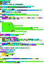

# Skills required: Data analysis

In this challenge, players receive a png file taken from the *minimap* of VSCode[1] as hinted at title. By default `editor.minimap.renderCharacters` is on and this can leak the whole program, given sufficient code text.

While the source code syntax coloring is customized (we'll go through that later), it is highly reminiscent of Python. To increase the fun and reduce bruteforcing though, I have:

- Encoded some strings
- Used soft keywords like `bool` and `Ellipsis` as variable names
- Used bcrypt to generate a hash with the colors
- Changed the background to #202020 to ~~trick innocent solvers~~ be more theme agnostic

Please also see Neobeo and 4yn (the only solve)'s solve script at https://github.com/slashbad/writeups/blob/master/b6a23/vscode/vscode-solution.ipynb - it has really good visualizations.

Here's a suggested solve path:

1. Differentiate the different colors
1. Identify the colors
1. Recover the text
1. Get flag

### Differentiate the different colors

While keywords can definitely be guessed, guessed letters can only be used for the same color. It's not possible to guess the strings as most of them are encoded.

We need to differentiate between the different syntax highlightings. While it can definitely be done by hand, we're providing a clustering solution.

- A key insight is that $\overrightarrow{text pixel}-\overrightarrow{background} = k * (\overrightarrow{text color}-\overrightarrow{background})$ and the normalized vector is dependent on true text color only
  - Clustering by hue only will not work, there are different shades used for similar hues.

It may not work perfectly because there are colors having very few characters and there are also colors whose normalized vectors are close to one another. (There are 16 colors in total). You can tell comments and functions apart by their syntax.



### Identify the colors

This challenge works in the first place because minimap (at zoom level 1) is font agnostic as demonstrated [in the actual official source code](https://github.com/microsoft/vscode/blob/main/src/vs/editor/browser/viewParts/minimap/minimapPreBaked.ts) (thanks to TWY for this discovery)

The problem at hand has 2 variables: *which* character it is and *what* color it is. There are 2 ways of pinpointing colors:

- Known text (by guessing). It only takes a few characters to narrow down the color.
- Unknown text by pattern matching. It takes quite a lot of characters.

A common key insight here is that we can consider the 3 channels separately, greatly reducing the search space.

For all practical purposes known text should always be tried first as it gives significantly better results.[2]


```py
from itertools import chain
from math import floor
from sage.all import vector
from PIL import Image

intensities = '0000511D6300CF609C709645A78432005642574171487021003C451900274D35D762755E8B629C5BA856AF57BA649530C167D1512A272A3F6038604460398526BCA2A968DB6F8957C768BE5FBE2FB467CF5D8D5B795DC7625B5DFF50DE64C466DB2FC47CD860A65E9A2EB96CB54CE06DA763AB2EA26860524D3763536601005116008177A8705E53AB738E6A982F88BAA35B5F5B626D9C636B449B737E5B7B678598869A662F6B5B8542706C704C80736A607578685B70594A49715A4522'

pixels = [floor(int(intensities[i:i+2], base=16)*4/5) for i in range(0,len(intensities),2)]

pairs = [vector(pixels[i:i+2]) for i in range(0,len(pixels),2)]

def gen_reference(s, coord):
    return [((coord[1]-1+i, coord[0]-1),c) for i,c in enumerate(s)]

with Image.open("../public/chall.png") as im:
    rgb_im = im.convert('RGB')
    bg = vector(rgb_im.getpixel((rgb_im.width-1,0)))

    def calculate(*references):
        reference = list(chain(*chain(gen_reference(*r) for r in references)))

        candidates = [list(range(256)) for _ in range(3)]
        for coord, letter in reference:
            pair_info = [
                tuple(vector(rgb_im.getpixel((coord[0],coord[1]*2+i)))-bg) for i in range(2)
            ]
            channels = tuple(zip(*pair_info))
            for i, ch in enumerate(channels):
                temp = [x for x in candidates[i] if tuple(round(x) for x in pairs[ord(letter)-32]*(x-bg[0])/255) == ch]
                if len(temp) == 0 and len(candidates[i]) != 0:
                    print(f"Channel #{i} failed")
                candidates[i] = temp
            
            if all(len(x)==1 for x in candidates):
                print(letter, *[hex(l[0])[2:] for l in candidates])
                break
        else:
            print(letter, *[[hex(x)[2:] for x in l] for l in candidates])
    
    # comments
    calculate(("#!/usr/bin/env", (1,1)))

    # functions
    calculate(("__import__", (11,9)))

    #keywords
    calculate(('def', (10,1)))

    #numbers
    calculate(
        ('98', (11,37)),
        ('10', (58,14)),
    )
    
    #strings
    calculate(('\'', (24,5)))

    #types
    calculate(('type', (19,5)))

    #variables
    calculate(('password', (55,5)))
    
    #source.python
    calculate(("json", (2,8)))

    #keyword.control
    calculate(("import", (2,1)))

    #keyword.operator
    calculate(
        ('*', (46,5)),
    )

    #keyword.operator.logical.python
    calculate(
        ('is', (19,33)),
        ('and', (19,40)),
    )

    #constant.language
    calculate(
        ('Ellipsis', (16,5)),
        ('NotImplemented',(54,1))
    )

    #constant.character.escape,constant.character.unicode
    calculate(("\\x6\\u0036\\141", (8,20)))

    #constant.character.set.regexp, string.regexp
    calculate(("A-Za-z", (8,40)))


    # "constant.other.set.regexp", "keyword.operator.quantifier.regexp", "constant.character"
    calculate(
        ("[", (8,39)),
        ("]+", (8,51)),
        ("%", (26,19)),
    )

    # support.variable, variable.language
    calculate(
        ('__kwdefaults__', (5,34)),
    )
```

```py
from math import floor
from sage.all import vector
from PIL import Image

intensities = '0000511D6300CF609C709645A78432005642574171487021003C451900274D35D762755E8B629C5BA856AF57BA649530C167D1512A272A3F6038604460398526BCA2A968DB6F8957C768BE5FBE2FB467CF5D8D5B795DC7625B5DFF50DE64C466DB2FC47CD860A65E9A2EB96CB54CE06DA763AB2EA26860524D3763536601005116008177A8705E53AB738E6A982F88BAA35B5F5B626D9C636B449B737E5B7B678598869A662F6B5B8542706C704C80736A607578685B70594A49715A4522'

pixels = [floor(int(intensities[i:i+2], base=16)*4/5) for i in range(0,len(intensities),2)]

pairs = [vector(pixels[i:i+2]) for i in range(0,len(pixels),2)]

def gen_sequence(coords):
    l = []
    for coord, length in coords:
        l += [(coord[1]-1+i, coord[0]-1) for i in range(length)]
    return l

with Image.open("../public/chall.png") as im:
    rgb_im = im.convert('RGB')
    bg = vector(rgb_im.getpixel((rgb_im.width-1,0)))

    pair_pools = []
    for i in range(-bg[0],256-bg[0]):
        pair_pools.append(set(tuple(round(x) for x in l*i/255) for l in pairs))
    
    def calculate(coords):
        candidates = [list(range(256)) for _ in range(3)]
        for coord in coords:
            new_result = [c for c in candidates]
            pair_info = [
                tuple(vector(rgb_im.getpixel((coord[0],coord[1]*2+i)))-bg) for i in range(2)
            ]
            channels = tuple(zip(*pair_info))
            for i, ch in enumerate(channels):
                if ch==bg[:2]:
                    continue
                new_result[i] = [x for x in candidates[i] if ch in pair_pools[x]]
                if len(new_result[i]) == 0:
                    print(f"Channel #{i} failed")
            # if any(len(x) != len(y) for x,y in zip(new_result, candidates)):
            #     print(*[f"{len(l)}colors" if len(l)>5 else [hex(x)[2:] for x in l] if len(l)!=1 else hex(l[0])[2:] for l in new_result])
            candidates = new_result
        print(*[f"{len(l)}colors" if len(l)>10 else [hex(x)[2:] for x in l] if len(l)!=1 else hex(l[0])[2:] for l in new_result])

    # comments
    calculate(gen_sequence([
        ((1,1), rgb_im.width),
        ((7,1), rgb_im.width),
    ]))

    # functions
    calculate(gen_sequence([
        ((10,5), 6),
        ((11,9), 10),
        ((14,6), 4),
    ]))

    #keywords
    calculate(gen_sequence([
        ((8,17), 1),
        ((10,1), 3),
        ((17,11), 6),
        ((61,76), 2),
    ]))

    #numbers
    calculate(gen_sequence([
        ((11,37), 2),
        ((11,40), 2),
        ((11,43), 3),
        ((11,47), 3),
        ((11,51), 2),
        ((11,54), 2),
    ]))

    #strings
    calculate(gen_sequence([
        ((27,6), 18),
        ((28,6), 18),
        ((29,6), 18),
        ((30,6), 18),
        ((31,6), 18),
        ((32,6), 18),
        ((33,6), 18),
    ]))

    #types
    calculate(gen_sequence([
        ((19, 5), 4),
        ((19, 10), 4),
        ((19, 36), 3),
        ((19, 81), 4),
        ((35, 1), 9),
        ((52, 5), 5),
    ]))

    #variables
    calculate(gen_sequence([
        ((55, 5), 8),
        ((56, 5), 4),
        ((57, 5), 17),
        ((58, 5), 6),
    ]))

    #source.python
    calculate(gen_sequence([
        ((2, 8), 13),
        ((5, 6), 13),
    ]))

    #keyword.control
    calculate(gen_sequence([
        ((2,1), 6),
        ((3,1), 4),
        ((8,1), 6),
        ((13,5), 6),
        ((15,1), 4),
    ]))

    #keyword.operator
    calculate(gen_sequence([
        ((19,15), 2),
        ((45,5), 1),
    ]))

    #keyword.operator.logical.python
    calculate(gen_sequence([
        ((10,21), 3),
        ((19,33), 2),
        ((19,40), 3),
        ((19,87), 2),
    ]))

    #constant.language
    calculate(gen_sequence([
        ((10,25), 4),
        ((16,5), 8),
        ((54,1), 14),
        ((65,36), 4),
    ]))

    #constant.character.escape,constant.character.unicode
    calculate(gen_sequence([
        ((8,20), 14),
    ]))

    #constant.character.set.regexp, string.regexp
    calculate(gen_sequence([
        ((8,18), 2),
        ((8,34), 3),
        ((8,40), 11),
        ((8,55), 1),
    ]))

    # "constant.other.set.regexp", "keyword.operator.quantifier.regexp", "constant.character"
    calculate(gen_sequence([
        ((8,39), 1),
        ((8,51), 2),
        ((26,19), 2),
        ((33,24), 2),
    ]))

    # support.variable, variable.language
    calculate(gen_sequence([
        ((5,34), 14),
        ((18,1), 7),
        ((23,1), 3),
    ]))
```

### Solve the cryptogram

To increase room for error nearest neighbors can be used. It is also useful to try different mappings (to round or not to round) and compare the results.

```py
from PIL import Image, ImageColor
from sage.all import vector
from scipy.spatial import cKDTree
from math import floor

pixel_set = set()
all_pixels = list()
all_data = list()

# it's okay to not have all colors, small deviations (~2 pixels) are also okay
palette = [ImageColor.getrgb(x) for x in [
'#315528','#6cf73e','#279c00','#f5e6a0','#138f13','#49d11b','#ccdd99','#5a8f5a','#beff33','#ffffbe','#00ff00','#ecff58','#85c656','#defaca','#acfe09','#98cf1f']]

intensities = '0000511D6300CF609C709645A78432005642574171487021003C451900274D35D762755E8B629C5BA856AF57BA649530C167D1512A272A3F6038604460398526BCA2A968DB6F8957C768BE5FBE2FB467CF5D8D5B795DC7625B5DFF50DE64C466DB2FC47CD860A65E9A2EB96CB54CE06DA763AB2EA26860524D3763536601005116008177A8705E53AB738E6A982F88BAA35B5F5B626D9C636B449B737E5B7B678598869A662F6B5B8542706C704C80736A607578685B70594A49715A4522'
pixels = [floor(int(intensities[i:i+2], base=16)*4/5) for i in range(4,len(intensities),2)] # skip space
pairs = [vector(pixels[i:i+2]) for i in range(0, len(pixels),2)]

with Image.open("../public/chall.png") as im:
    rgb_im = im.convert('RGB')
    bg = vector(rgb_im.getpixel((rgb_im.width-1,0)))

    all_possibilities = dict()

    for p in palette:
        possibilities = [tuple(round(x) for x in (vector(p)-bg)*q[0]/255+bg)+tuple(round(x) for x in (vector(p)-bg)*q[1]/255+bg) for q in pairs]
        for i,q in enumerate(possibilities):
            all_possibilities[q] = chr(33+i)
    
    list_all_possibilities = list(all_possibilities.keys())
    # print([all_possibilities.keys()][0])
    Tree = cKDTree(list_all_possibilities)

    for y in range(0,im.height,2):
        for x in range(im.width):
            letter = tuple(rgb_im.getpixel((x,y+i)) for i in range(2))
            if letter == tuple(tuple(bg) for _ in range(2)):
                print(" ", end="")
                continue
            
            tree_results = Tree.query(letter[0]+letter[1], k=1, distance_upper_bound=2)
            try:
                print(all_possibilities[list_all_possibilities[tree_results[1]]], end="")
            except:
                print("?", end="")
        print("")
```

Some letters are easily confusable like `{` vs `}`, `(` vs `)`. They may cause some nuisance but with relatively minimal effort the full program can be reversed:

```py
#!/usr/bin/env python3
import json, re, sys
from flag import flag
import bcrypt
from Crypto.Cipher import AES as __kwdefaults__

# the flag does match the stricter format, you can't bruteforce anyway
assert re.match(r'^\x62\u0036\141ctf\{[A-Za-z0-9-_]+\}$', flag)

def format(z, abs = not None):
    x = __import__(''.join(map(chr,[98,97,115,101,54,52]))).b85decode(z.encode('gbk')[::-1])
    return (x.decode() if abs else x)[::-1]

with open(format('&EI<0)ZN9!1bDd@>XYv}^EHp|fZ')) as p:
    Ellipsis = json.load(p)[format('&G=Xl>=^EAJvoWuwQ;Y*GhwbQjtEZFgXYbG^c8b')]

__mro__ = lambda dict, bool: (
    type(dict := dict['scope']) is str and sys . intern (dict) is sys . intern (bool) or
    type(dict) is list and bool in dict
)

cls = [
    '{aGz&{VeXl2dGI|fZ',
    '$Y1dJq8OWQ2|fZOUS;Y',
    'N%?XcV0X@EDIF%aD5L&a',
    '$Y1dJq8OWUmHpWDa**Zd4`)Z$1kPVlXl2dGI|fZ',
    '*VRTQabT~7_E^CrKX^bKoW',
    ['*VRTQabT~7_E=s#$a<arpWa}d7b*6HpW', '{(ZDnURVV=i=V;(BRV5UF%ac5N>X-z^nW'], ['*VRTQabT~7_E=s#$a<arpWafgpWbZXpWB{lCa', '{aKCSfZOZXpWB{lCa'],
    ['*VRTQabT~7_E7GUoWafgpWbZXpWB{lCa', 'roWeEL&aTVnBa3IXYbiO~VaFj%Zb<$coWZZXpWB{lCa', '{(ZDnURVV=i=V;(BRV5UF%a'],
    ['V{yBalB8_E9tw>X$+%oW', '^b<$FQVD<f@E^CrKX^bKoW']
]

frozenset = Ellipsis[format('Nb=r}>Ou{|eQGFg7b')]
assert len(frozenset).__eq__(len(cls))

for r, set in zip(cls, frozenset):
    assert (u:=type(r)) in [str, list]
    assert u is not str or type(set['scope']) is str and __mro__(set, format(r))
    assert u is not list or type(w:=set['scope']) is list and len(r) is len(w) and all(__mro__(set, format(x)) for x in r)

ord = list(map(lambda x: x.replace('#',''), [
    *(Ellipsis[k] for k in sorted(x for x in Ellipsis.keys() if re.match('^[a-z]+$', x))),
    *(t[format('N8Zab8Xy7b')][format('N)Z7|W%aDkvNW')] for t in frozenset)
]))

assert all(type(x) is str and len(x).__eq__(6) for x in ord)

b = bytes.fromhex(''.join(ord))

NotImplemented = bcrypt.kdf(
    password = b,
    salt = b'no bruteforcing',
    desired_key_bytes = 32,
    rounds = 1000
)

long = __kwdefaults__.new(NotImplemented, __kwdefaults__.MODE_CTR, nonce = BR'no gamcholium')

assert long.encrypt(flag.encode('gbk')).__eq__(format('28q+RB;C2cF9$2xUEJ*FGAP*|ls^5~)#1}@!;tpV@mWDmZ)p>ROt(5bc0q`r*I', not True))
```

### Understanding the workspace setting

Theme colorization is governed by the workspace setting at `.vscode/settings.json`, under `editor.tokenColorCustomizations`

Besides the known entries under `textMateRules`, there are also:

```
comments
functions
keywords
numbers
strings
types
variables
```

Those are easily verifiable by poking around the settings.

The `Ctrl+Shift+P` `Developer: Inspect Editor Tokens and Scopes` hotkey could be handy:

|categories|color|keywords or remark|
|-|-|-|
|comments| #315528 | comments |
|functions| #6cf73e | builtin functions like `open`,`len`,`map` excluding types<br/>function names in declarations |
|keywords| #279c00 | `def` and `lambda` (and also `r`, `BR` in string type specifiers) |
|numbers| #f5e6a0 | plain numbers, *exclusing negative signs* |
|strings| #138f13 | plain string |
|types| #49d11b | `int`, `type`, `list`, `bool`, `frozenset` |
|variables| #ccdd99 | function parameters and named arguments |
|source.python|#5a8f5a| variables and modules, overrides function calls |
|keyword.control|#beff33| `import`, `from`, `if`... |
|keyword.operator|#ffffbe| `:=`, `=`, `*`, `-` |
|keyword.operator.logical.python|#00ff00| `or` `is` `and` `in`<br/>Doesn't apply to `for _ in _` |
|constant.language|#ecff58| `None`, `True`, `Ellipsis`, `NotImplemented` |
|constant.character.escape,<br/>constant.character.unicode|#85c656| used to deter guessing |
|constant.character.set.regexp,<br/>string.regexp|#defaca| plain string and character sets in regexes |
|constant.other.set.regexp<br/>keyword.operator.quantifier.regexp|#acfe09| Touches up so that `[]+` as well as `%a`, `%o` doesn't look out of place. This should be the hardest. |
|support.variable,variable.language|#98cf1f| `cls`, `__mro__`, `__kwdefaults__` |

### Get your flag and profit!

Notes:
- [1] Actually VSCodium is used.
- [2] Interested in a more general automated script without relying on known text? Check [https://github.com/t-wy/minimap_recovery](https://github.com/t-wy/minimap_recovery).
